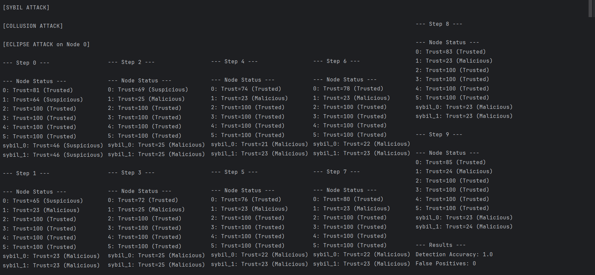
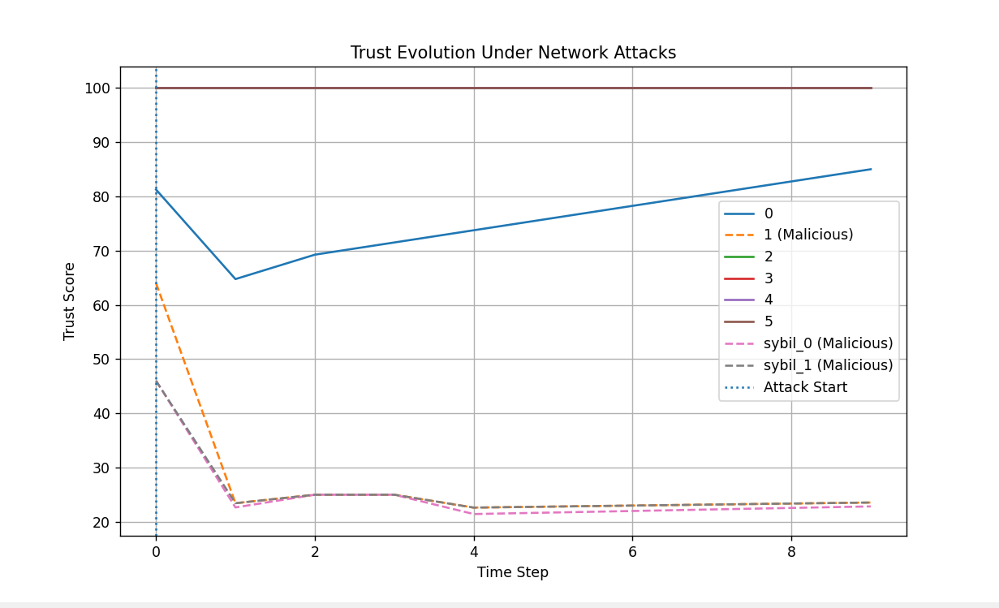

# Trust-Aware Blockchain P2P Network Security Simulation


## 📌 Overview

**Trust-Aware Blockchain P2P Network** is a Python-based simulation project that demonstrates how trust-aware mechanisms can be used to detect malicious behavior in blockchain-inspired peer-to-peer systems.

The project addresses network-layer security challenges in decentralized environments, particularly attacks targeting peer communication such as Sybil, collusion, and eclipse attacks. It models a blockchain-inspired peer-to-peer network at the networking layer—rather than full consensus implementation—where nodes exchange transactions, blocks, and gossip-based trust values.

This work investigates how lightweight, decentralized trust mechanisms can enhance the resilience of blockchain P2P networks against adversarial behavior without relying on centralized control.

This simulation serves as a foundation for studying trust-aware defense strategies in decentralized and Web3 networking environments.

---

## 🎯 Highlights

- Detects Sybil, collusion, and eclipse attacks
- Achieves strong detection accuracy with zero false positives under the evaluated simulation scenarios
- Demonstrates trust-based defense in P2P blockchain networks
- Includes simulation + visualization (graph + terminal output)

---

## 💡 Project Motivation

Blockchain and Web3 systems rely heavily on peer-to-peer communication. Since there is no central authority controlling the network, malicious peers can attempt to disrupt communication, manipulate reputation, isolate honest nodes, or influence consensus behavior.

Common network-layer attacks such as Sybil attacks, collusion attacks, and eclipse attacks can reduce the reliability and security of decentralized systems. This project explores how a lightweight trust-aware detection mechanism can help improve the resilience of blockchain-based P2P networks.

---

## ⚙️ Key Features

- Simulates a blockchain-inspired peer-to-peer network
- Implements basic transaction and block structures using `Transaction` and `Block` classes
- Uses SHA-256 hashing to generate transaction IDs and block hashes
- Supports basic transaction and block propagation
- Uses trust scoring to evaluate node behavior
- Supports local trust and global trust calculation
- Includes gossip-based trust sharing between peers
- Simulates Sybil, collusion, and eclipse attacks
- Detects malicious nodes based on trust degradation
- Calculates detection accuracy and false positives
- Visualizes trust evolution over time using Matplotlib

---

## 🚨 Attack Models

### ⚠️ 1. Sybil Attack

In a Sybil attack, an attacker creates multiple fake identities in the network. These fake nodes may attempt to influence trust, disrupt communication, or manipulate peer behavior.

In this project, Sybil nodes are added to the network and marked as malicious. Their trust values decrease over time as their malicious behavior is detected.

### ⚠️ 2. Collusion Attack

In a collusion attack, one or more malicious nodes work together to influence the network. Colluding nodes may attempt to support each other or disrupt honest nodes.

In this simulation, selected nodes are marked as malicious colluding nodes. Their behavior is evaluated through trust scoring.

### ⚠️ 3. Eclipse Attack

In an eclipse attack, an honest node is surrounded or isolated by malicious peers. The attacker controls the victim node’s peer connections and can influence the information it receives.

In this project, Node `0` is selected as the eclipse attack target. Its peers are replaced with malicious nodes, causing temporary trust impact. The simulation evaluates whether the node can recover and avoid false classification as malicious under adversarial conditions.

---

## 🔗 Blockchain Components

The blockchain layer of this project is implemented in `blockchain.py`. It provides simplified `Transaction` and `Block` classes that support the simulation of transaction creation and block generation.

### 🔁 Transaction Class

The `Transaction` class represents a basic blockchain transaction. Each transaction stores the sender identity, timestamp, and a unique transaction ID.

The transaction ID is generated using SHA-256 hashing:

```python
self.tx_id = hashlib.sha256(
    f"{sender}{self.timestamp}{random.random()}".encode()
).hexdigest()
```

This ensures that each transaction receives a unique identifier during the simulation.

### 🧱 Block Class

The `Block` class represents a simplified blockchain block. Each block contains a list of transactions, the hash of the previous block, a timestamp, a nonce, and its own block hash.

The block hash is generated using SHA-256:

```python
def compute_hash(self):
    data = str(self.prev_hash) + str(self.timestamp) + str(self.nonce)
    return hashlib.sha256(data.encode()).hexdigest()
```

This creates a simplified block hash using the previous block hash, timestamp, and nonce.

In this project, the blockchain component is intentionally simplified. The focus of the simulation is not on full blockchain consensus or mining, but on studying trust-aware detection of malicious behavior in a blockchain-inspired peer-to-peer network.

---

## 🔍 Trust Model

Each node maintains three trust values:

### 🤝 Local Trust

Local trust is based on direct interactions with other nodes. If a node sends valid transactions or blocks, its trust increases. If it sends invalid or malicious data, its trust decreases.

### 🌐 Global Trust

Global trust is calculated using gossip-based reputation values shared by trusted peers.

### ✅ Final Trust

Final trust is calculated using a weighted combination of local and global trust.

Example:

```python
final_trust = 0.75 * local_trust + 0.25 * global_trust
```

Nodes are classified based on their final trust score:

| Trust Score | Status |
|---|---|
| Greater than 70 | Trusted |
| 31 to 70 | Suspicious |
| 30 or below | Malicious |

To ensure reproducibility of results, a fixed random seed (`random.seed(42)`) is used in the simulation.

---

## 📁 Project Structure

```text
TrustAware-Blockchain-P2P-Network/
│
├── blockchain.py        # Transaction and block classes
├── node.py              # Node behavior, trust model, transaction/block handling
├── network.py           # Peer-to-peer network connection logic
├── gossip.py            # Gossip-based trust exchange
├── attacks.py           # Sybil, collusion, and eclipse attack simulation
├── metrics.py           # Detection accuracy and false positive calculation
├── visualization.py     # Trust evolution graph
├── main.py              # Main simulation runner
│
├── output.png           # Terminal output screenshot
├── graph.png            # Trust evolution graph image
│
└── README.md            # Project documentation
```

---

## ✅ Requirements

This project requires Python 3 and Matplotlib.

Install the required package:

```bash
pip install matplotlib
```

---

## 🚀 How to Run

Clone the repository:

```bash
git clone https://github.com/Antaneetta01/Trust-Aware-Blockchain-P2P-Network-Security-Simulation.git
```

Go to the project directory:

```bash
cd Trust-Aware-Blockchain-P2P-Network-Security-Simulation
```

Run the simulation:

```bash
python main.py
```

On Windows, if you are using a virtual environment:

```bash
.venv\Scripts\python.exe main.py
```

The simulation is deterministic due to the use of a fixed random seed, ensuring consistent results across runs.

---

## 🔍 Sample Output

```text
[SYBIL ATTACK]

[COLLUSION ATTACK]

[ECLIPSE ATTACK on Node 0]

--- Step 0 ---

--- Node Status ---
0: Trust=81 (Trusted)
1: Trust=64 (Suspicious)
2: Trust=100 (Trusted)
3: Trust=100 (Trusted)
4: Trust=100 (Trusted)
5: Trust=100 (Trusted)
sybil_0: Trust=46 (Suspicious)
sybil_1: Trust=46 (Suspicious)

--- Step 1 ---

--- Node Status ---
0: Trust=65 (Suspicious)
1: Trust=23 (Malicious)
2: Trust=100 (Trusted)
3: Trust=100 (Trusted)
4: Trust=100 (Trusted)
5: Trust=100 (Trusted)
sybil_0: Trust=23 (Malicious)
sybil_1: Trust=23 (Malicious)

--- Results ---
Detection Accuracy: 1.0
False Positives: 0
```

---

## 🧪 Simulation Output

### 🖥️ Terminal Output

The following screenshot shows the terminal execution of the simulation, including attack stages, node trust updates, and final evaluation metrics.



---

## 📈 Result Interpretation

The simulation demonstrates that malicious nodes are effectively detected through trust degradation.

These results indicate that the proposed trust model is not only effective in detecting malicious nodes but also robust against transient trust degradation caused by adversarial network conditions.

### 🎯 Final Result

| Metric | Value |
|---|---:|
| Total Nodes | 8 |
| Honest Nodes | 5 |
| Malicious Nodes | 3 |
| Detected Malicious Nodes | 3 |
| Detection Accuracy | 1.0 |
| False Positives | 0 |

The result shows that the trust-aware mechanism correctly identifies Sybil and colluding malicious nodes while avoiding false positives among honest nodes.

Node `0`, which is the eclipse attack target, temporarily drops into the suspicious range due to isolation by malicious peers. However, it later recovers and is not falsely classified as malicious. This demonstrates that the trust mechanism can detect malicious nodes while tolerating temporary attack impact on honest nodes.

---

## 📊 Trust Evolution Graph

The following graph shows how trust values change over time for honest and malicious nodes under Sybil, collusion, and eclipse attacks.



Key observations:

- Malicious nodes drop below the malicious threshold
- Honest nodes remain stable and trusted
- The eclipsed node shows temporary trust reduction
- Recovery occurs after attack influence
- Clear separation between honest and malicious behavior

---

## 🎓 Research Relevance

This project is relevant to research areas such as:

- Blockchain network security
- Web3 infrastructure security
- Peer-to-peer network resilience
- Distributed trust management
- Sybil attack detection
- Eclipse attack mitigation
- Gossip-based reputation systems
- Secure decentralized communication
- Trust-aware defense mechanisms

The simulation provides a simple but practical foundation for studying how decentralized systems can detect and respond to malicious peer behavior.

---

## ⚠️ Limitations

This project is a simulation and does not represent a full production blockchain system.

Current limitations include:

- Small number of simulated nodes
- Simplified blockchain and consensus logic
- Simplified block hashing that does not include full transaction contents
- Simplified transaction and block validation
- Basic trust scoring model
- No real network sockets or distributed deployment
- No cryptographic signature validation
- No real-world blockchain client integration

---

## 🔮 Future Improvements

Possible future improvements include:

- Scaling the simulation to hundreds or thousands of nodes
- Adding real cryptographic signatures
- Implementing a more realistic consensus mechanism
- Testing adaptive attackers
- Adding network latency and message loss
- Comparing the trust model with baseline detection methods
- Integrating with a real blockchain test network
- Improving gossip filtering against colluding attackers
- Adding precision, recall, and F1-score metrics
- Exporting simulation results to CSV for analysis

---

## 🧠 Technologies Used

- Python
- Matplotlib
- Python `hashlib` for SHA-256 hashing
- Basic blockchain data structures
- Peer-to-peer simulation
- Trust and reputation modeling

---

## 👩‍💻 Author

**Antaneetta Libina Mendez**

Cybersecurity researcher with interests in:

- Network security
- Blockchain and Web3 security
- Distributed systems
- IoT security
- Trust-aware defense mechanisms
- Secure and resilient decentralized infrastructures

---

## 📜 License

This project is released for academic and educational purposes.

You may modify and extend it for research, learning, or demonstration purposes.

---

## ⭐ Disclaimer

This project is a simplified academic simulation. It is intended for learning and research demonstration only and should not be used as a production security system without significant improvement, validation, and testing.
